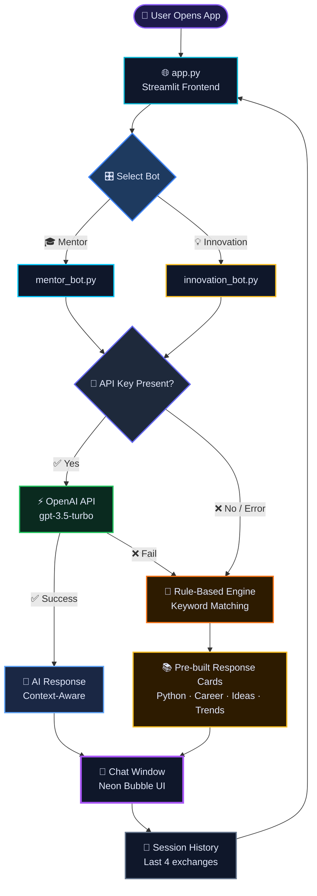
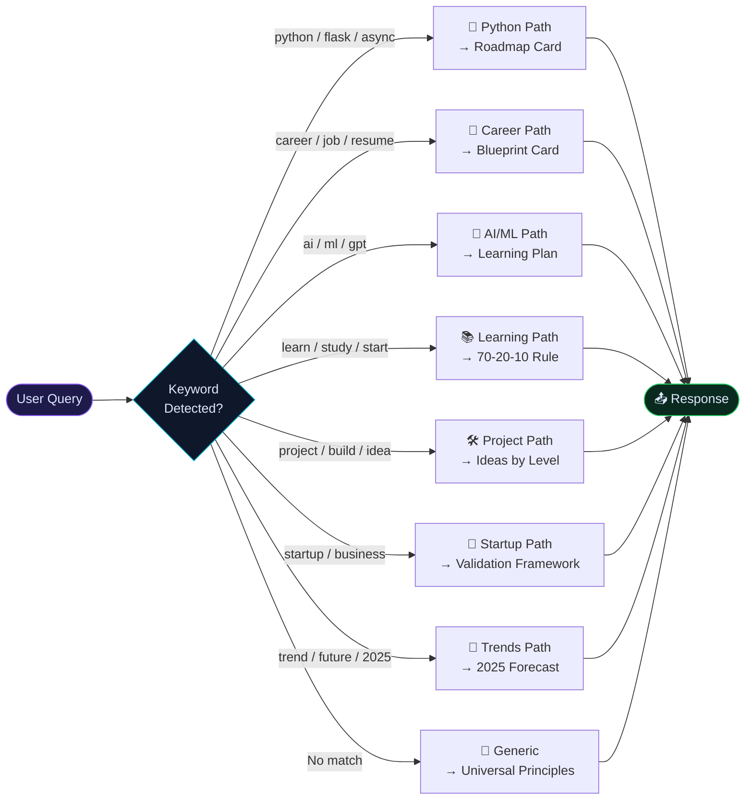
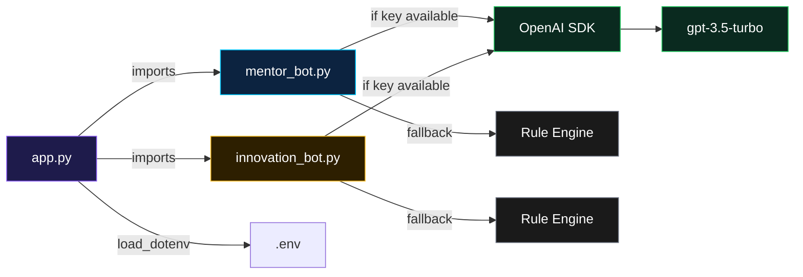
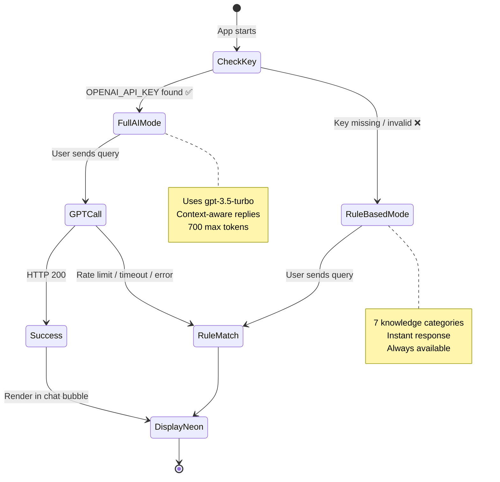
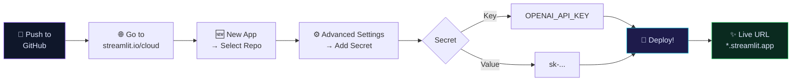
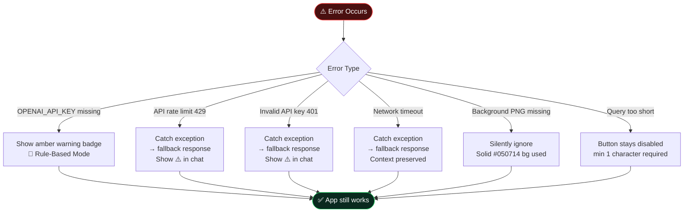
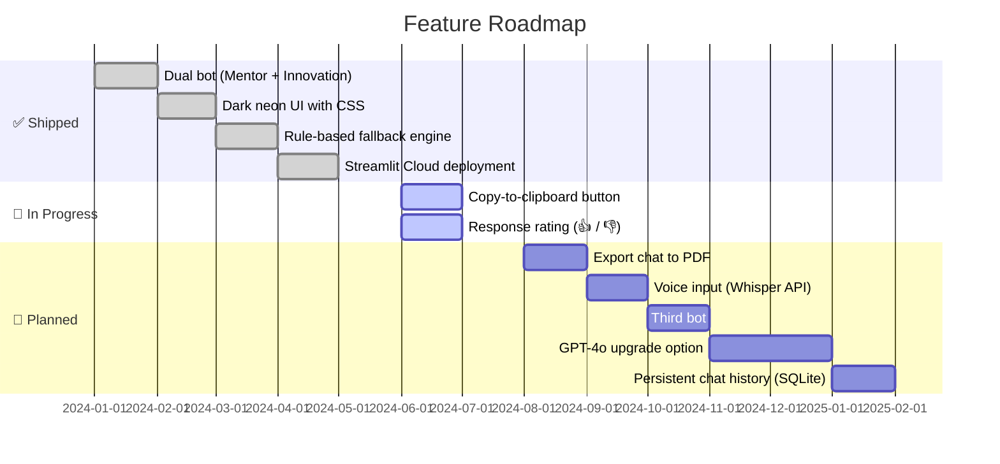

<div align="center">

<!-- ═══════════════════════════════════════════════════════════════════ -->
<!--                        HERO SECTION                               -->
<!-- ═══════════════════════════════════════════════════════════════════ -->


<!-- Live Demo Badge -->
<a href="https://openaiapibotapp-njcwnpm8ccv8sk5j4mr5fs.streamlit.app/" target="_blank">
  
</a>

<br/><br/>

<!-- Shield Badges Row 1 -->


<br/>

<!-- Shield Badges Row 2 -->


<br/><br/>

<!-- Tagline -->
<h3>
  🎓 <strong>Mentor Bot</strong> guides your code & career &nbsp;·&nbsp;
  💡 <strong>Innovation Bot</strong> sparks your next big idea
</h3>

<p>
  <strong>Zero setup · No API key required · Works offline with rule-based fallback</strong>
</p>

<p>
  🔗 <a href="https://openaiapibotapp-njcwnpm8ccv8sk5j4mr5fs.streamlit.app/"><strong>Try the Live Demo →</strong></a>
</p>

</div>

---

<!-- ═══════════════════════════════════════════════════════════════════ -->
<!--                      TABLE OF CONTENTS                            -->
<!-- ═══════════════════════════════════════════════════════════════════ -->

## 📋 Table of Contents

| # | Section |
|---|---------|
| 01 | [🏗️ System Architecture](#️-system-architecture) |
| 02 | [✨ Features](#-features) |
| 03 | [🤖 The Two Bots](#-the-two-bots) |
| 04 | [🔄 Data Flow Diagram](#-data-flow-diagram) |
| 05 | [🧱 Project Structure](#-project-structure) |
| 06 | [🛠️ Quick Start](#️-quick-start) |
| 07 | [☁️ Deploy to Streamlit Cloud](#️-deploy-to-streamlit-cloud) |
| 08 | [🧪 Example Conversations](#-example-conversations) |
| 09 | [⚙️ Configuration Reference](#️-configuration-reference) |
| 10 | [🛡️ Error Handling](#️-error-handling) |
| 11 | [🗺️ Roadmap](#️-roadmap) |
| 12 | [🤝 Contributing](#-contributing) |
| 13 | [📄 License](#-license) |

---

<!-- ═══════════════════════════════════════════════════════════════════ -->
<!--                    SYSTEM ARCHITECTURE                            -->
<!-- ═══════════════════════════════════════════════════════════════════ -->

## 🏗️ System Architecture

```
┌─────────────────────────────────────────────────────────────────────────────┐
│                         OpenAI API Bot Starter                              │
│                      System Architecture Overview                           │
└─────────────────────────────────────────────────────────────────────────────┘

  ┌──────────────┐     query      ┌─────────────────────────────────────────┐
  │              │ ────────────►  │            app.py (Streamlit UI)         │
  │  👤  User    │                │  ┌──────────┐  ┌───────────────────────┐ │
  │              │ ◄────────────  │  │ Bot Radio │  │  Chat Window + CSS    │ │
  └──────────────┘    response    │  │ Selector  │  │  Neon Glow + Dark Mode│ │
                                  │  └─────┬─────┘  └───────────────────────┘ │
                                  └────────┼────────────────────────────────────┘
                                           │
                        ┌──────────────────┴─────────────────┐
                        │                                     │
                        ▼                                     ▼
          ┌─────────────────────────┐         ┌──────────────────────────────┐
          │   🎓  mentor_bot.py     │         │   💡  innovation_bot.py       │
          │                         │         │                               │
          │  System Prompt:         │         │  System Prompt:               │
          │  "Expert tech mentor    │         │  "Innovation catalyst,        │
          │   15+ yrs experience"   │         │   creative problem-solver"    │
          │                         │         │                               │
          │  Topics:                │         │  Topics:                      │
          │  • Python & Code        │         │  • Startup ideas              │
          │  • Career guidance      │         │  • SCAMPER framework          │
          │  • Learning roadmaps    │         │  • Tech trends 2025           │
          │  • Git & DevOps         │         │  • First principles           │
          └────────────┬────────────┘         └──────────────┬────────────────┘
                       │                                      │
                       └──────────────┬───────────────────────┘
                                      │
                          ┌───────────┴──────────┐
                          │   API Key Check       │
                          └──────────┬────────────┘
                                     │
                   ┌─────────────────┴──────────────────┐
                   │                                     │
                   ▼                                     ▼
      ┌────────────────────────┐          ┌──────────────────────────────┐
      │  ⚡ OpenAI GPT-3.5     │          │  🔧 Rule-Based Fallback       │
      │  Turbo API             │          │                               │
      │                        │          │  Keyword matching engine:     │
      │  • Context-aware       │          │  • python → roadmap card      │
      │  • 700 max tokens      │          │  • career → job advice card   │
      │  • Temp 0.7/0.9        │          │  • idea → SCAMPER framework   │
      │  • Last 6 msgs history │          │  • startup → validation tips  │
      │                        │          │  • Confidence: always 100%    │
      └────────────────────────┘          └──────────────────────────────┘
```

---

## 🔄 Data Flow Diagram



---

## 🤖 Bot Decision Logic



---

<!-- ═══════════════════════════════════════════════════════════════════ -->
<!--                         FEATURES                                  -->
<!-- ═══════════════════════════════════════════════════════════════════ -->

## ✨ Features

<div align="center">

| Feature | Description | Status |
|:-------:|-------------|:------:|
| 🤖 **Dual AI Bots** | Mentor Bot + Innovation Bot with distinct personalities | ✅ |
| 🎨 **Neon Dark UI** | Glassmorphism cards, gradient borders, glowing text | ✅ |
| ⚡ **Instant Fallback** | Works 100% without OpenAI key — rule-based engine | ✅ |
| 🧠 **Context Memory** | Last 4 exchanges maintained in session history | ✅ |
| 💬 **Chat Bubbles** | User + bot styled separately, auto-scrolling | ✅ |
| 🎯 **Quick Chips** | One-click suggestion buttons per bot persona | ✅ |
| 📱 **Mobile Ready** | Responsive columns, compact layout | ✅ |
| 🔒 **Secure** | API key never logged, stored only in `.env` or Streamlit secrets | ✅ |
| 🛑 **Error Safe** | Every API failure shows a user-friendly message | ✅ |
| 🌙 **CSS Dark Mode** | Pure inline CSS — no external dependencies | ✅ |

</div>

---

<!-- ═══════════════════════════════════════════════════════════════════ -->
<!--                        THE TWO BOTS                               -->
<!-- ═══════════════════════════════════════════════════════════════════ -->

## 🤖 The Two Bots

<table>
<tr>
<td width="50%" valign="top">

### 🎓 Mentor Bot

> *"15-year veteran tech mentor — straight-talking, specific, actionable."*

**Expertise Areas:**

```
🐍  Python & Programming
💼  Career & Job Hunting
📚  Learning Roadmaps
🛠️  Project Planning
🤖  AI & Machine Learning
🔧  Git & DevOps
```

**Response Style:**
- Structured bullet points
- Code blocks when relevant
- Resource recommendations
- 70-20-10 learning framework

**Best Questions to Ask:**
```
"What's a Python learning roadmap?"
"How do I get my first dev job?"
"Explain decorators in Python"
"Give me project ideas for beginners"
```

</td>
<td width="50%" valign="top">

### 💡 Innovation Bot

> *"Creative catalyst — SCAMPER, First Principles, Design Thinking."*

**Expertise Areas:**

```
🚀  Startup Ideas & Validation
🧠  Brainstorming Frameworks
🔮  Tech Trends 2025
🎨  Product Design Thinking
💥  Disruption Strategies
🌍  Emerging Markets
```

**Response Style:**
- Energetic, expansive thinking
- Framework-driven answers
- Bold counter-intuitive ideas
- Concrete examples + metaphors

**Best Questions to Ask:**
```
"Give me a startup idea"
"How do I brainstorm better?"
"What tech trends should I follow?"
"Help me think about this problem differently"
```

</td>
</tr>
</table>

---

## 🧱 Project Structure

```
openai_api_bot_streamlit/
│
├── 🐍  app.py                   ← Main Streamlit app (UI + routing + session)
│                                   CSS: dark theme, neon glows, chat bubbles
│
├── 🎓  mentor_bot.py            ← Mentor personality
│                                   • OPENAI_SYSTEM_PROMPT (expert tech mentor)
│                                   • Rule-based RULES dict (7 categories)
│                                   • respond(query, history, api_key) → str
│
├── 💡  innovation_bot.py        ← Innovation personality
│                                   • OPENAI_SYSTEM_PROMPT (creative catalyst)
│                                   • Rule-based RULES dict (7 categories)
│                                   • respond(query, history, api_key) → str
│
├── 🔑  .env                     ← Local secrets (NEVER commit to Git)
│       └── OPENAI_API_KEY=sk-...
│
└── 🖼️  assets/
        ├── background.png       ← Optional dark futuristic wallpaper
        └── architecture.png     ← System diagram for README
```

**Dependency graph:**



---

<!-- ═══════════════════════════════════════════════════════════════════ -->
<!--                        QUICK START                                -->
<!-- ═══════════════════════════════════════════════════════════════════ -->

## 🛠️ Quick Start

### Prerequisites

```bash
Python 3.9+
pip (or pip3)
```

### Step-by-step

**1️⃣ Clone the repository**

```bash
git clone https://github.com/yourusername/openai_api_bot_streamlit.git
cd openai_api_bot_streamlit
```

**2️⃣ Install dependencies**

```bash
pip install streamlit openai python-dotenv
```

Or from a requirements file:

```bash
# requirements.txt
streamlit>=1.28.0
openai>=1.0.0
python-dotenv>=1.0.0
```

```bash
pip install -r requirements.txt
```

**3️⃣ Set up your API key** *(optional — app works without it)*

```bash
# Create a .env file in the project root
echo "OPENAI_API_KEY=sk-your-key-here" > .env
```

> 💡 No key? That's fine — the app uses its built-in rule-based engine automatically.

**4️⃣ Run the app**

```bash
streamlit run app.py
```

Your browser opens at **http://localhost:8501** 🎉

---

## 🔑 API Key Modes



---

<!-- ═══════════════════════════════════════════════════════════════════ -->
<!--                     STREAMLIT CLOUD DEPLOY                        -->
<!-- ═══════════════════════════════════════════════════════════════════ -->

## ☁️ Deploy to Streamlit Cloud

Get your own **free** 24/7 live app in under 5 minutes:



**Settings to use:**

| Setting | Value |
|---------|-------|
| **Repository** | `yourusername/openai_api_bot_streamlit` |
| **Branch** | `main` |
| **Main file path** | `app.py` |
| **Secret key** | `OPENAI_API_KEY` |
| **Python version** | `3.11` |

> ⚠️ **Never commit your `.env` file to GitHub.** Add `.env` to `.gitignore`.

---

<!-- ═══════════════════════════════════════════════════════════════════ -->
<!--                    EXAMPLE CONVERSATIONS                          -->
<!-- ═══════════════════════════════════════════════════════════════════ -->

## 🧪 Example Conversations

<details>
<summary><strong>🎓 Mentor Bot — Python Question</strong></summary>

---

**User:**
> How do I become a Python developer from zero?

**Mentor Bot:**
```
🐍 Python Learning Roadmap:

Beginner (Weeks 1–4):
• Variables, data types, loops, functions
• List comprehensions, file I/O
• Virtual environments (python -m venv env)

Intermediate (Months 2–3):
• OOP: classes, inheritance, dunder methods
• Decorators, generators, context managers
• Libraries: NumPy, Pandas, Requests

Advanced:
• Async/await, multithreading
• FastAPI or Django REST Framework
• Testing with pytest

💡 Daily tip: Build one small project per week.
Theory without practice is forgotten fast.
```

---

</details>

<details>
<summary><strong>💡 Innovation Bot — Startup Idea</strong></summary>

---

**User:**
> I want to build an AI startup. What should I focus on?

**Innovation Bot:**
```
🚀 AI Innovation Opportunities in 2024–2025:

Underserved Niches:
• AI legal document drafting for freelancers
• Personalized learning paths for trade skills
• AI-powered audit/compliance for SMBs
• Voice AI for elderly care
• Code review bot for junior developers

High-Leverage AI Applications:
1. RAG systems → Make any document queryable
2. AI agents → Automate multi-step workflows
3. Multimodal apps → Text + image + audio input

Build Fast Strategy:
• Use OpenAI API (no ML degree required)
• Deploy on Vercel/Railway for free
• Validate with 10 beta users in week 1

💡 AI gives solo developers 10x leverage.
One person can now build what took a team.
```

---

</details>

<details>
<summary><strong>🤖 Without API Key (Rule-Based Mode)</strong></summary>

---

**User:**
> Explain quantum computing

**Mentor Bot:** *(no API key set)*
```
🎯 Mentor Advice for: "explain quantum computing"

Universal principles for every developer challenge:

1. Break it down — Divide your problem into smallest pieces
2. Search smart — Official docs → Stack Overflow → GitHub Issues
3. Build a prototype — A working rough version beats perfect planning

💡 Want deeper help? Be more specific:
"How do quantum gates work in Python with Qiskit?"
gets better results than "explain quantum computing".

Running in Rule-Based Mode — add your OpenAI API key
in .env for smarter, dynamic responses.
```

---

</details>

---

<!-- ═══════════════════════════════════════════════════════════════════ -->
<!--                    CONFIGURATION REFERENCE                        -->
<!-- ═══════════════════════════════════════════════════════════════════ -->

## ⚙️ Configuration Reference

### Environment Variables

| Variable | Required | Default | Description |
|----------|----------|---------|-------------|
| `OPENAI_API_KEY` | ❌ Optional | `""` | Your OpenAI secret key. Leave blank for rule-based mode. |

### OpenAI Parameters (inside `mentor_bot.py` / `innovation_bot.py`)

| Parameter | Mentor Bot | Innovation Bot | Description |
|-----------|-----------|----------------|-------------|
| `model` | `gpt-3.5-turbo` | `gpt-3.5-turbo` | Model to use |
| `max_tokens` | `700` | `700` | Maximum response length |
| `temperature` | `0.7` | `0.9` | Creativity level (0=deterministic, 1=creative) |
| `history_window` | Last 6 msgs | Last 6 msgs | Conversation context passed to API |

### Customizing the System Prompts

Open `mentor_bot.py` and edit `MENTOR_SYSTEM_PROMPT`:

```python
MENTOR_SYSTEM_PROMPT = """You are an expert tech mentor with 15+ years in software engineering.
You give clear, actionable advice on programming, career development, and learning strategies.
# ← Edit this to change the bot's personality, tone, and focus areas
"""
```

---

<!-- ═══════════════════════════════════════════════════════════════════ -->
<!--                      ERROR HANDLING                               -->
<!-- ═══════════════════════════════════════════════════════════════════ -->

## 🛡️ Error Handling



**Key principle:** The app **never crashes** — every error path leads to a usable fallback state.

---

<!-- ═══════════════════════════════════════════════════════════════════ -->
<!--                          ROADMAP                                  -->
<!-- ═══════════════════════════════════════════════════════════════════ -->

## 🗺️ Roadmap



---

<!-- ═══════════════════════════════════════════════════════════════════ -->
<!--                       CONTRIBUTING                                -->
<!-- ═══════════════════════════════════════════════════════════════════ -->

## 🤝 Contributing

Contributions are **welcome and appreciated!**

```bash
# 1. Fork the repository on GitHub

# 2. Clone your fork
git clone https://github.com/yourusername/openai_api_bot_streamlit.git
cd openai_api_bot_streamlit

# 3. Create a feature branch
git checkout -b feature/your-amazing-feature

# 4. Make your changes, then stage and commit
git add .
git commit -m "✨ feat: add your amazing feature"

# 5. Push to your fork
git push origin feature/your-amazing-feature

# 6. Open a Pull Request on GitHub
```

**Commit message conventions:**

| Prefix | Usage |
|--------|-------|
| `✨ feat:` | New feature |
| `🐛 fix:` | Bug fix |
| `🎨 style:` | UI / CSS changes |
| `♻️ refactor:` | Code refactor (no feature change) |
| `📚 docs:` | Documentation only |
| `🧪 test:` | Tests |

---

## 📄 License

```
MIT License

Copyright (c) 2024 OpenAI API Bot Starter

Permission is hereby granted, free of charge, to any person obtaining a copy
of this software and associated documentation files (the "Software"), to deal
in the Software without restriction, including without limitation the rights
to use, copy, modify, merge, publish, distribute, sublicense, and/or sell
copies of the Software, and to permit persons to whom the Software is
furnished to do so, subject to the following conditions:

The above copyright notice and this permission notice shall be included in all
copies or substantial portions of the Software.
```

See [LICENSE](LICENSE) for full text.

---

## 🙏 Acknowledgements

<div align="center">

| Tool | Purpose |
|:----:|---------|
| [OpenAI](https://openai.com) | The GPT-3.5-turbo API powering intelligent responses |
| [Streamlit](https://streamlit.io) | The framework that made this app possible in hours, not weeks |
| [draw.io](https://app.diagrams.net) | Architecture diagram creation |
| [Shields.io](https://shields.io) | Beautiful README badges |
| [Capsule Render](https://github.com/kyechan99/capsule-render) | Animated README header banner |
| [Mermaid](https://mermaid.js.org) | In-markdown flowcharts and diagrams |

</div>

---

<!-- ═══════════════════════════════════════════════════════════════════ -->
<!--                       FOOTER                                      -->
<!-- ═══════════════════════════════════════════════════════════════════ -->


<div align="center">

Made with 🛠️, ☕, and a futuristic neon glow

**⭐ Star this repo if it helped you — it means the world!**

<a href="https://github.com/yourusername/openai_api_bot_streamlit/stargazers">
  
</a>
&nbsp;
<a href="https://github.com/yourusername/openai_api_bot_streamlit/fork">
  
</a>

<br/>

[](#-openai-api-bot-starter)

</div>
