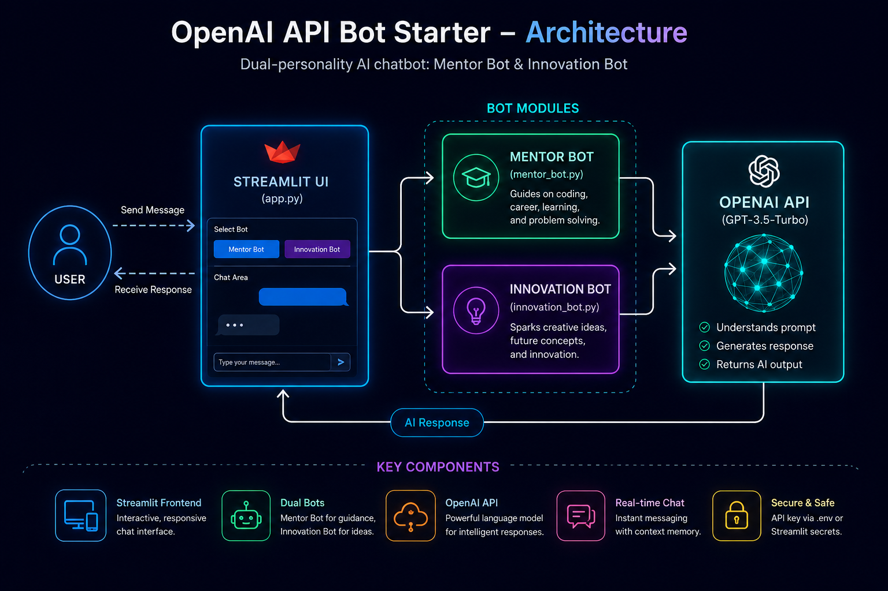

# 🚀 OpenAI API Bot Starter

> A futuristic, dual‑personality AI chatbot powered by Streamlit + OpenAI — ready to **mentor** or **innovate**.

<p align="center">
  <a href="https://openaiapibotapp-njcwnpm8ccv8sk5j4mr5fs.streamlit.app/" target="_blank">
    
  </a>
  
  
  
  
</p>

🔗 **Live Demo:** [openaiapibotapp.streamlit.app](https://openaiapibotapp-njcwnpm8ccv8sk5j4mr5fs.streamlit.app/)

---

## 🏗️ System Architecture

```mermaid
flowchart TD
    A[👤 User] -->|types query| B[🌐 Streamlit UI<br>app.py]
    B -->|selects bot| C{🤖 Bot Router}
    C -->|Mentor Bot| D[🧠 mentor_bot.py]
    C -->|Innovation Bot| E[💡 innovation_bot.py]
    D -->|API call| F[⚡ OpenAI API]
    E -->|API call| F
    F -->|generated response| B
    B -->|displays neon reply| A
    style A fill:#0e1625,stroke:#00ffcc,stroke-width:2px,color:#fff
    style B fill:#0e1625,stroke:#ff00cc,stroke-width:2px,color:#fff
    style C fill:#0e1625,stroke:#92fe9e,stroke-width:2px
    style D fill:#0e1625,stroke:#00c9ff,stroke-width:2px
    style E fill:#0e1625,stroke:#ffcc00,stroke-width:2px
    style F fill:#0e1625,stroke:#ff6600,stroke-width:2px
```



💡 GitHub automatically renders this diagram.
For an even better look, export the diagram as PNG from draw.io and save as assets/architecture.png. Then uncomment the  tag below:

<!-- <p align="center"></p> -->

---

✨ Features

Feature Description
🤖 Two AI Bots Mentor Bot – guides on coding, career & learning.   Innovation Bot – sparks futuristic, creative ideas.
🎨 Neon UI Dark futuristic theme with glowing borders, hover effects, and optional background.
⚡ Fast & Lightweight Built on Streamlit, uses OpenAI’s GPT‑3.5‑Turbo.
🔒 Secure API key stays local (.env) or via Streamlit secrets.
📱 Mobile Friendly Responsive layout, quick prompts, scrollable chat.
🧠 Context‑Aware Remembers conversation history for natural replies.

---

🖥️ Live Demo

Click the badge above or go to:
👉 https://openaiapibotapp-njcwnpm8ccv8sk5j4mr5fs.streamlit.app/

No installation required — just open the link and start chatting!

Note: The demo uses a shared OpenAI API key. For your own private version, deploy your own copy (see below).

---

🧱 Project Structure

```
openai_api_bot_streamlit/
├── app.py                # Main Streamlit app (UI + logic)
├── mentor_bot.py         # Mentor Bot API handler
├── innovation_bot.py     # Innovation Bot API handler
├── .env                  # Environment variables (API key)
└── assets/
    ├── architecture.png  # Optional architecture diagram image
    └── background.png    # Optional futuristic background
```

---

🛠️ Run Locally (for your own API key)

1️⃣ Clone the repository

```bash
git clone https://github.com/yourusername/openai_api_bot_streamlit.git
cd openai_api_bot_streamlit
```

2️⃣ Install dependencies

```bash
pip install streamlit openai python-dotenv
```

3️⃣ Add your OpenAI API key

Create a .env file:

```ini
OPENAI_API_KEY=sk-...
```

4️⃣ (Optional) Add a background image

Place any background.png inside the assets/ folder.

5️⃣ Run the app

```bash
streamlit run app.py
```

---

☁️ Deploy Your Own Copy (Streamlit Cloud)

1. Push this code to a GitHub repository.
2. Go to Streamlit Cloud → New app → select your repo.
3. In Advanced settings, add a secret:
   · Key: OPENAI_API_KEY
   · Value: your-api-key
4. Click Deploy — your private bot will be live in seconds.

⚠️ Never commit your actual API key to GitHub.

---

🧪 Example Conversation

User: Explain quantum computing in simple terms.

Mentor Bot:

Quantum computing uses quantum bits, or qubits, which can be in multiple states at once thanks to superposition. This allows quantum computers to solve certain problems much faster than classical computers.

Innovation Bot:

Imagine a computer that doesn't just switch between 0 and 1, but can be both at the same time – like a coin spinning in the air. That's a qubit. With many spinning coins, you can explore millions of possibilities at once, unlocking new frontiers in medicine, cryptography, and artificial intelligence.

---

🛡️ Error Handling

· Missing API key → friendly error message inside the app.
· API failure (rate limit, network) → clear error displayed in chat.
· Missing background image → falls back to a solid dark colour.

---

🤝 Contributing

Pull requests are welcome! For major changes, please open an issue first.

---

📄 License

MIT — free to use, modify, and distribute.

---

🙏 Acknowledgements

· OpenAI for the API
· Streamlit for the amazing framework
· The open‑source community

---

<p align="center">
  Made with 🛠️, ☕, and a futuristic glow.  
  <br>
  ⭐ Star this repo if you like it!
</p>
```
