# 🚀 OpenAI API Bot Starter

<p align="center">
  <a href="https://openaiapibotapp-njcwnpm8ccv8sk5j4mr5fs.streamlit.app/" target="_blank">
    
  </a>
</p>

<p align="center">
  
  
  
  
  
</p>

<h3 align="center">
  A futuristic, dual‑personality AI chatbot powered by Streamlit + OpenAI —<br>
  ready to <strong style="color:#00c9ff">mentor</strong> or <strong style="color:#ffcc00">innovate</strong>.
</h3>

<p align="center">
  🔗 <strong>Live Demo:</strong> <a href="https://openaiapibotapp-njcwnpm8ccv8sk5j4mr5fs.streamlit.app/">openaiapibotapp.streamlit.app</a>
</p>

---

## 📖 Table of Contents

- [🏗️ System Architecture](#️-system-architecture)
- [✨ Features](#-features)
- [🖥️ Live Demo](#️-live-demo)
- [🧱 Project Structure](#-project-structure)
- [🛠️ Run Locally](#️-run-locally)
- [☁️ Deploy to Streamlit Cloud](#️-deploy-to-streamlit-cloud)
- [🧪 Example Conversation](#-example-conversation)
- [🛡️ Error Handling](#️-error-handling)
- [🤝 Contributing](#-contributing)
- [📄 License](#-license)
- [🙏 Acknowledgements](#-acknowledgements)

---

## 🏗️ System Architecture

```mermaid
flowchart TD
    A[👤 User] -->|types query| B[🌐 Streamlit UI<br>app.py]
    B -->|selects bot| C{🤖 Bot Router}
    C -->|Mentor Bot| D[🧠 mentor_bot.py]
    C -->|Innovation Bot| E[💡 innovation_bot.py]
    D -->|API call| F[⚡ OpenAI API]
    E -->|API call| F
    F -->|generated response| B
    B -->|displays neon reply| A
    style A fill:#0e1625,stroke:#00ffcc,stroke-width:2px,color:#fff
    style B fill:#0e1625,stroke:#ff00cc,stroke-width:2px,color:#fff
    style C fill:#0e1625,stroke:#92fe9e,stroke-width:2px
    style D fill:#0e1625,stroke:#00c9ff,stroke-width:2px
    style E fill:#0e1625,stroke:#ffcc00,stroke-width:2px
    style F fill:#0e1625,stroke:#ff6600,stroke-width:2px
```

The app follows a clean, modular flow – from user input to AI response.

### 📸 Visual Diagram (PNG)

<p align="center">
  
  <br>
  <em>Export from <a href="https://app.diagrams.net/">draw.io</a> – click to zoom.</em>
</p>

### 📝 Text‑based Diagram (Mermaid)

GitHub renders this automatically. It's the same flow as the PNG above.



💡 What is Mermaid?
Mermaid is a markdown‑based diagramming tool. GitHub reads the code block above and turns it into a beautiful flowchart. No extra software needed.

---

✨ Features

Feature Description
🤖 Two AI Bots Mentor Bot – guides on coding, career & learning. Innovation Bot – sparks futuristic, creative ideas.
🎨 Neon UI Dark futuristic theme with glowing borders, hover effects, and optional background image.
⚡ Fast & Lightweight Built on Streamlit, powered by OpenAI’s GPT‑3.5‑Turbo.
🔒 Secure Your API key stays local (.env) or via Streamlit secrets – never exposed.
📱 Mobile Friendly Responsive layout, quick prompts, and a scrollable chat container.
🧠 Context‑Aware Remembers conversation history for natural, coherent replies.
📋 Copy‑to‑Clipboard (Optional) Click the copy button on any bot response.

---

🖥️ Live Demo

👉 Try it now: https://openaiapibotapp-njcwnpm8ccv8sk5j4mr5fs.streamlit.app/

No installation, no API key needed – just click and start chatting.

Note: The demo uses a shared OpenAI API key with rate limits. For your own private, unlimited version, deploy a copy (see below).

---

🧱 Project Structure

```
openai_api_bot_streamlit/
├── app.py                # Main Streamlit app (UI + session + routing)
├── mentor_bot.py         # Mentor Bot – system prompt + OpenAI call
├── innovation_bot.py     # Innovation Bot – creative system prompt
├── .env                  # Environment variables (OPENAI_API_KEY)
└── assets/
    ├── architecture.png  # Architecture diagram (used in README)
    └── background.png    # Optional dark futuristic background
```

---

🛠️ Run Locally (Use Your Own API Key)

1️⃣ Clone the repository

```bash
git clone https://github.com/yourusername/openai_api_bot_streamlit.git
cd openai_api_bot_streamlit
```

2️⃣ Install dependencies

```bash
pip install streamlit openai python-dotenv
```

3️⃣ Add your OpenAI API key

Create a .env file in the root:

```ini
OPENAI_API_KEY=sk-...
```

4️⃣ (Optional) Add a background image

Place any background.png inside the assets/ folder. The app will automatically overlay it with a dark gradient.

5️⃣ Run the app

```bash
streamlit run app.py
```

Your browser will open at http://localhost:8501 – enjoy!

---

☁️ Deploy to Streamlit Cloud

Want your own 24/7 live bot? Deploy in minutes:

1. Push your code to a GitHub repository (public or private).
2. Go to Streamlit Cloud → New app → select your repo.
3. In Advanced settings, add a secret:
   · Key: OPENAI_API_KEY
   · Value: your-actual-api-key
4. Click Deploy – your app will be live at a *.streamlit.app URL.

⚠️ Never commit your actual API key to GitHub. Always use .env locally and secrets on the cloud.

---

🧪 Example Conversation

User:

Explain quantum computing in simple terms.

Mentor Bot:

Quantum computing uses quantum bits, or qubits, which can be in multiple states at once thanks to superposition. This allows quantum computers to solve certain problems much faster than classical computers.

Innovation Bot:

Imagine a computer that doesn't just switch between 0 and 1, but can be both at the same time – like a coin spinning in the air. That's a qubit. With many spinning coins, you can explore millions of possibilities at once, unlocking new frontiers in medicine, cryptography, and artificial intelligence.

---

🛡️ Error Handling

· Missing API key → The app shows a clear error message at the top and stops further calls.
· OpenAI API failure (rate limit, network, invalid key) → An error message is displayed inside the chat, so you never lose context.
· Missing background image → Falls back to a solid dark #0a0f1e colour – still looks great.
· Missing architecture PNG → The Mermaid diagram still works on GitHub, and the README links to instructions.

---

🤝 Contributing

Contributions, issues, and feature requests are welcome!
Feel free to check the issues page.

1. Fork the project
2. Create your feature branch (git checkout -b feature/amazing)
3. Commit your changes (git commit -m 'Add some amazing feature')
4. Push to the branch (git push origin feature/amazing)
5. Open a Pull Request

---

📄 License

Distributed under the MIT License. See LICENSE for more information.

---

🙏 Acknowledgements

· OpenAI – for the powerful API
· Streamlit – for making AI apps fun and fast
· Draw.io – for the architecture diagram tool
· All open‑source contributors

---

<p align="center">
  Made with 🛠️, ☕, and a futuristic glow.<br>
  ⭐ <strong>Star this repo</strong> if it helped you – it means a lot!
</p>
```

